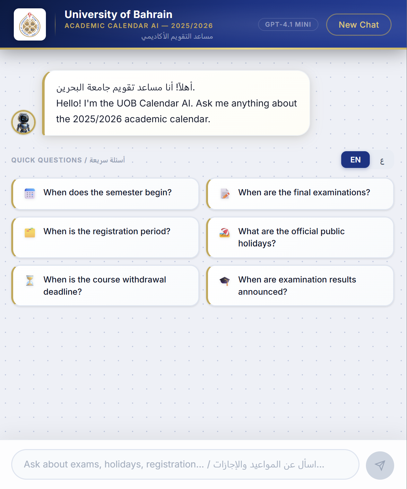

# UOB Calendar AI

A bilingual (Arabic + English) AI assistant for the University of Bahrain academic calendar 2025/2026.
Built with a hybrid FAQ + RAG pipeline — common questions are answered instantly from a pre-written FAQ, rare or time-relative questions fall back to a streaming LLM that only sees the 4 most relevant calendar chunks.

Includes a React web UI with UOB branding and a FastAPI backend.

---

## Preview

<p align="center">
  
</p>

---

## Features

- **Bilingual** — detects Arabic vs English automatically; supports Gulf/Khaleeji dialect question variants
- **Arabic normalization** — strips hamza/taa-marbuta/alef-maqsura/tatweel variants before embedding so "اول" and "أول" match identically
- **Arabic spell correction** — [camel-tools](https://github.com/CAMeL-Lab/camel_tools) MSA spell checker auto-corrects typos (e.g. "الامتحانت" → "الامتحانات", "تسيجل" → "تسجيل") after dialect normalization, before embedding
- **Dialect normalization** — 70+ Gulf slang/loanword mappings convert terms like "الفاينل", "الميدترم", "دروب", "السيمستر" to standard academic Arabic before embedding — no model retraining needed
- **FAQ-first** — 36 FAQ entries with 650+ question variants handle ~90% of questions with zero LLM cost
- **Streaming responses** — LLM answers type out token by token via SSE; FAQ answers appear instantly
- **Date-aware routing** — 70+ date-sensitive patterns intercept questions like "is registration open?", "did I miss it?", "withdrawal deadline", "اخر يوم دراسي", "الحين", "لسا", "الجاي" and route them to the LLM instead of returning a static FAQ answer
- **Upcoming vs past** — bot correctly returns upcoming events, not already-past ones (e.g. asking "when are finals?" in April 2026 returns June 2026 finals, not December 2025)
- **RAG fallback** — only the top 4 relevant calendar chunks are sent to the LLM, never the full document
- **Conversation memory** — remembers last 10 turns; detects English and Arabic follow-up phrases ("بس", "لكن", "يعني") and expands the embed query with prior context
- **Input sanitization** — truncates at 500 chars, strips control characters, rejects gibberish
- **Rate limiting** — max 30 messages per 10-minute rolling window per session
- **Error handling** — graceful fallback if OpenAI API is unavailable; user-friendly error messages
- **React web UI** — chat interface with UOB navy/gold theme, suggestion chips, EN/AR toggle, typing indicator, bot avatar

---

## How It Works

The system has two phases: a one-time **setup** that pre-computes embeddings, and a **per-request pipeline** that runs every time a user asks a question.

### Phase 1 — Setup (runs once)

Your data files are converted into vectors (numerical representations of meaning) and saved locally. This only needs to be re-run when you change the data.

```
uob_faq.json          embed_faq.py        OpenAI Embed API
(36 Q&A entries)  ──────────────────→  text-embedding-3-small
                                               │
                                               ↓
                                      faq_embeddings.json
                                      (vectors for every FAQ question)

uob_calendar.md       embed_calendar.py   OpenAI Embed API
(73 event rows)   ──────────────────→  text-embedding-3-small
                                               │
                                               ↓
                                      calendar_embeddings.json
                                      (vectors for every calendar event)
```

### Phase 2 — Per-request pipeline

Every time a user sends a message, this pipeline runs:

```
USER SENDS A MESSAGE
        │
        ▼
┌───────────────────────────────┐
│ 1. SANITIZE                   │
│    · Truncate to 500 chars    │
│    · Strip control characters │
│    · Reject gibberish/symbols │
└──────────────┬────────────────┘
               │
               ▼
┌───────────────────────────────┐
│ 2. RATE LIMIT CHECK           │
│    Max 30 messages per        │
│    10-minute window/session   │
│    → 429 error if exceeded    │
└──────────────┬────────────────┘
               │
               ▼
┌───────────────────────────────┐
│ 3. FOLLOW-UP DETECTION        │
│    Does the question start    │
│    with "it", "that", "بس",  │
│    "لكن", or is it ≤3 words? │
│    YES → prepend last         │
│    question for better search │
└──────────────┬────────────────┘
               │
               ▼
┌───────────────────────────────┐
│ 4. NORMALIZE ARABIC           │
│    Unify character variants:  │
│    أ / إ / آ / ٱ  →  ا       │
│    ة  →  ه                    │
│    ى  →  ا                    │
│    Remove diacritics/tatweel  │
│    (so "اول" = "أول")         │
└──────────────┬────────────────┘
               │
               ▼
┌───────────────────────────────┐
│ 5. DIALECT NORMALIZATION      │
│    70+ Gulf/Khaleeji slang    │
│    and loanword mappings:     │
│    "الفاينل" → "الامتحانات   │
│     النهائية"                 │
│    "الميدترم" → "امتحان      │
│     منتصف الفصل"              │
│    "دروب" → "حذف"             │
│    "السيمستر" → "الفصل"       │
│    "امتى" → "متى"             │
│    No model needed — pure     │
│    dictionary substitution    │
└──────────────┬────────────────┘
               │
               ▼
┌───────────────────────────────┐
│ 6. SPELL CORRECTION           │
│    camel-tools MSA spell      │
│    checker fixes remaining    │
│    typos after slang is       │
│    already normalized:        │
│    "الامتحانت" →              │
│      "الامتحانات"             │
│    "تسيجل" → "تسجيل"         │
│    "متا" → "متى"              │
│    Graceful fallback if       │
│    camel-tools not installed  │
└──────────────┬────────────────┘
               │
               ▼
┌───────────────────────────────┐
│ 7. EMBED THE QUERY            │
│    OpenAI text-embedding-     │
│    3-small converts the       │
│    normalized question into   │
│    a 1536-dimensional vector  │
└──────────────┬────────────────┘
               │
               ▼
┌───────────────────────────────┐
│ 6. SEARCH FAQ VECTORS         │
│    Compare query vector       │
│    against all FAQ question   │
│    vectors using cosine       │
│    similarity → get a score   │
│    between 0.0 and 1.0        │
└──────────────┬────────────────┘
               │
        ┌──────┴───────┐
        │              │
   score ≥ 0.70    score < 0.70
   (good match)   (no match)
        │              │
        ▼              │
┌──────────────┐       │
│ 8. DATE-     │       │
│ SENSITIVE?   │       │
│              │       │
│ Does the     │       │
│ question     │       │
│ need today's │       │
│ date to      │       │
│ answer?      │       │
│              │       │
│ Examples:    │       │
│ "did I miss" │       │
│ "is it open" │       │
│ "withdrawal" │       │
│ "اخر يوم"   │       │
│ "الحين/لسا" │       │
└──┬───────┬───┘       │
   │       │           │
  NO      YES          │
   │       └───────────┤
   │                   │
   ▼                   ▼
┌──────────────┐  ┌─────────────────────────────────┐
│ FAQ ANSWER   │  │ LLM ANSWER (gpt-4.1-mini)        │
│              │  │                                  │
│ Return the   │  │ 1. Find top 4 most relevant      │
│ pre-written  │  │    calendar chunks by vector     │
│ answer from  │  │    similarity                    │
│ uob_faq.json │  │                                  │
│ instantly —  │  │ 2. Send to LLM with:             │
│ no LLM call  │  │    · Today's date & semester     │
│              │  │    · Those 4 calendar chunks     │
│ Arabic   →   │  │    · Last 10 conversation turns  │
│ answer_ar    │  │    · Language instruction        │
│ English  →   │  │                                  │
│ answer_en    │  │ 3. Stream answer token by token  │
│              │  │    to the UI via SSE             │
│ Source tag:  │  │                                  │
│ "FAQ: 84%"   │  │ Source tag: "RAG fallback: 71%"  │
└──────────────┘  └─────────────────────────────────┘
```

### Why two paths?

The **FAQ path** is instant and costs almost nothing (just one embedding call). It handles ~90% of questions where the answer never changes — holidays, tuition fees, semester dates.

The **LLM path** is used for anything time-relative. It costs slightly more but reasons correctly — *"the add/drop deadline was Feb 12, it's now April 21, so yes you missed it"* — something a static FAQ answer can never do.

---

## Date-Sensitive Routing

FAQ answers are static strings — they have no knowledge of today's date.
Without `is_date_sensitive()`, a question like *"when are the final exams?"* in April 2026 would match the `fall_finals` FAQ entry and return December 2025 dates — already past.

The function checks for 70+ patterns across four categories:

| Category | Examples |
|---|---|
| Status checks | "is it open", "can i still", "did I miss", "is it too late" |
| Generic multi-semester | "when are finals", "when are results", "withdrawal deadline" |
| Last/first day (generic) | "last day of classes", "اخر يوم دراسي", "اول يوم دوام" |
| Gulf Arabic colloquial | "الحين", "لسا", "الجاي", "خلص", "باقي كم", "فاتني", "هالفترة" |

When triggered, the question is routed to the LLM which receives today's date and current academic period and can reason: *"finals are upcoming in June 2026"* rather than returning a hardcoded past answer.

---

## Date Awareness

Every LLM call has a date context block injected into the message:

```
Today is: Wednesday, 21 April 2026
Current academic period: Second Semester 2025/2026 (classes in progress)

CRITICAL RULES:
- You KNOW today's date. Never say "if today is..." — state facts directly.
- NEVER mention today's date in your response. Use natural relative language:
  'upcoming', 'already past', 'opens in X days', 'deadline has passed'.
```

The LLM answers relative to today without ever echoing the date back to the user.

### Academic Period Boundaries

| Period | Start | End |
|--------|-------|-----|
| First Semester (classes) | 7 Sep 2025 | 18 Dec 2025 |
| First Semester (finals) | 19 Dec 2025 | 8 Jan 2026 |
| Second Semester (classes) | 3 Feb 2026 | 14 May 2026 |
| Second Semester (finals) | 15 May 2026 | 30 May 2026 |
| Summer Session (classes) | 1 Jul 2026 | 7 Aug 2026 |
| Summer Session (finals) | 8 Aug 2026 | 14 Aug 2026 |

---

## Arabic Processing Pipeline

Before embedding, every Arabic query passes through three layers of normalization. The same transformations are applied when generating FAQ embeddings, so both sides match consistently.

### Layer 1 — Character Normalization

Reduces Unicode spelling variation caused by different keyboard layouts and encoding habits:

| Transformation | Example |
|---|---|
| Alef variants (أ إ آ ٱ) → ا | "أول" → "اول" |
| Taa marbuta (ة) → ه | "جامعة" → "جامعه" |
| Alef maqsura (ى) → ا | "مبنى" → "مبنا" |
| Strip diacritics | "مُحاضَرة" → "محاضره" |
| Strip tatweel (ـ) | "جـامعة" → "جامعه" |

### Layer 2 — Dialect & Slang Normalization

70+ ordered substitutions convert Gulf/Khaleeji dialect, loanwords, and student slang into standard academic Arabic — without any model or training data. Applied before embedding so FAQ similarity scores stay high even for casual phrasing:

| Input (slang/dialect) | Normalized |
|---|---|
| الفاينل / فاينلز / الفينال | الامتحانات النهائية |
| الميدترم / ميد ترم / الميد | امتحان منتصف الفصل |
| الاد والدروب / دروب | الحذف والإضافة |
| السيمستر / الترم | الفصل الدراسي |
| امتى / ايمتى | متى |
| النتايج / رزلتس | النتائج |
| سحب مادة | الانسحاب من المقررات |
| بريليم | التسجيل المبدئي |
| اخر يوم للدروب | آخر موعد الحذف والإضافة |

### Layer 3 — Spell Correction (camel-tools)

After slang is already mapped to standard Arabic, [camel-tools](https://github.com/CAMeL-Lab/camel_tools) MSA spell checker fixes remaining typos:

| Typo | Corrected |
|---|---|
| الامتحانت | الامتحانات |
| تسيجل | تسجيل |
| متا | متى |
| الجامعه البحرين | الجامعة البحرين |

This layer is **optional** — if camel-tools is not installed, the server starts normally and falls back to layers 1 and 2 only. A startup message indicates which mode is active.

---

## Streaming

The `/chat/stream` endpoint returns a Server-Sent Events (SSE) stream:

```
data: {"type": "token", "text": "الامتحانات"}
data: {"type": "token", "text": " النهائية"}
...
data: {"type": "done", "source": "RAG (date-sensitive) — 73%", "warning": null}
```

- **LLM path** — tokens stream one by one as the model generates them
- **FAQ path** — full answer sent as a single `token` event immediately (no LLM latency)

The frontend fills the bot message word by word in real time.

---

## Why pgvector Instead of numpy?

**Before (numpy):**
- On every server start, all embeddings are loaded from JSON files into RAM
- Every question is compared against every vector one by one in a Python loop

**After (pgvector):**
- Vectors are stored permanently in a PostgreSQL database
- Search is a single SQL query using the `<=>` cosine distance operator — no Python loop
- Faster, no RAM overhead, data persists even if the server restarts

The app detects automatically: if `DATABASE_URL` is set it uses pgvector, otherwise it falls back to the numpy/JSON mode for local development.

---

## Why Not Pure RAG?

| | Pure RAG | This Project |
|---|---|---|
| Every question uses LLM | Yes | No — FAQ handles ~90% |
| LLM context | Full document | Top 4 chunks only |
| Same question = same answer | LLM may rephrase | Always identical (FAQ) |
| Hallucination risk on dates | Yes | No for FAQ; minimized for RAG |
| Cost per common question | ~$0.001 | ~$0.000001 (embed only) |
| Response speed | 1-3s always | Instant for FAQ hits |

---

## Files

| File | What it does |
|------|-------------|
| `api.py` | FastAPI backend — FAQ match, streaming SSE endpoint, RAG fallback, rate limiting |
| `core.py` | Shared logic — Arabic normalization, date-sensitive routing, LLM calls, follow-up detection |
| `chat.py` | CLI chatbot — same logic as api.py for terminal use |
| `uob_faq.json` | 36 Q&A entries with 650+ Arabic + English question variants |
| `uob_calendar.md` | Full academic calendar source document |
| `embed_faq.py` | Embeds FAQ questions using OpenAI — run once, re-run after editing `uob_faq.json` |
| `embed_calendar.py` | Chunks calendar into 73 events and embeds each using OpenAI — run once |
| `eval_threshold.py` | Evaluates FAQ similarity threshold across test cases |
| `faq_embeddings.json` | Generated by `embed_faq.py` — gitignored, must generate locally |
| `calendar_embeddings.json` | Generated by `embed_calendar.py` — gitignored, must generate locally |
| `db.py` | PostgreSQL connection pool + pgvector query functions |
| `migrate_to_pgvector.py` | One-time script: loads JSON embeddings → Postgres |
| `frontend/` | React + Vite web UI |
| `requirements.txt` | Python dependencies |
| `.env` | API keys and DATABASE_URL — never committed |

---

## Setup

### 1. Install dependencies

```bash
pip install -r requirements.txt
```

Then download the camel-tools Arabic spell model (one-time, ~200 MB):

```bash
camel_data download -i MSA-Spelling-r1
```

> This step is optional — the server starts and works without it, falling back to character normalization + dialect dictionary only. A startup message will confirm whether the spell checker loaded successfully.

### 2. Configure environment

Create a `.env` file:
```
OPENAI_API_KEY=your_openai_key_here
DATABASE_URL=postgresql://postgres:[password]@[host]:5432/postgres
```

`DATABASE_URL` points to a PostgreSQL instance with the pgvector extension.
**Free options:** [Supabase](https://supabase.com) or [Neon](https://neon.tech) — both have pgvector built-in and free tiers.

If `DATABASE_URL` is not set, the app falls back to numpy-based in-memory search using the local JSON files (useful for quick local dev).

### 3. Generate embeddings (once)

```bash
python embed_faq.py
python embed_calendar.py
```

Re-run `embed_faq.py` any time you edit `uob_faq.json`.

### 4. Migrate embeddings to PostgreSQL (once)

After setting `DATABASE_URL`, run the migration to load all vectors into Postgres:

```bash
python migrate_to_pgvector.py
```

This creates two tables (`faq_embeddings`, `calendar_chunks`), inserts all vectors, and builds IVFFlat cosine indexes. Safe to re-run — clears and reloads each time.

### 5. Start the backend

```bash
python -m uvicorn api:app --port 8001
```

On startup it prints either:
- `pgvector mode: embeddings served from PostgreSQL` — if `DATABASE_URL` is set
- `numpy mode: 36 FAQ entries, N calendar chunks loaded` — if using local JSON fallback

### 6. Start the frontend

```bash
cd frontend
npm install
npm run dev
```

Open `http://localhost:5173`

---

## Tech Stack

```
Embeddings:  OpenAI text-embedding-3-small (1536 dimensions)
LLM:         OpenAI gpt-4.1-mini
Streaming:   Server-Sent Events (SSE) via FastAPI StreamingResponse
Backend:     FastAPI + uvicorn
Frontend:    React + Vite
Matching:    pgvector cosine similarity (PostgreSQL <=> operator)
             Fallback: numpy cosine similarity (local dev)
RAG:         Top-4 chunk retrieval per query
Language:    Arabic/Latin character ratio (>50% Arabic → AR)
Arabic NLP:  3-layer pipeline — character normalization → dialect mapping
             (70+ Gulf slang entries) → camel-tools MSA spell correction
Storage:     PostgreSQL + pgvector (fallback: flat JSON for local dev)
```
